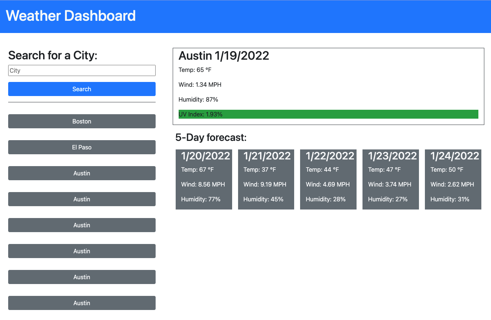

# Weather Dashboard

Title: Weather Dashboard

Developer: Francis Bond

Deployment Date: Jan 19, 2022

For: UT Coding Bootcamp

Published: GitHub 

Built with: HTML, CSS, Boostrap, Javascript, jQuery and openweatherAPI

## Summary

Page displays shows the current and forecast weather of any given city.

User can input any city they would like, 8 cities are saved to the search history.

When search history buttons are clicked, their information is displayed.

Deployed project link: https://francis-bond.github.io/weatherdashboard/

## Development

Working with server side APIs has shown me how easily you can can connect you web application to other sources to help make it more interactive.

